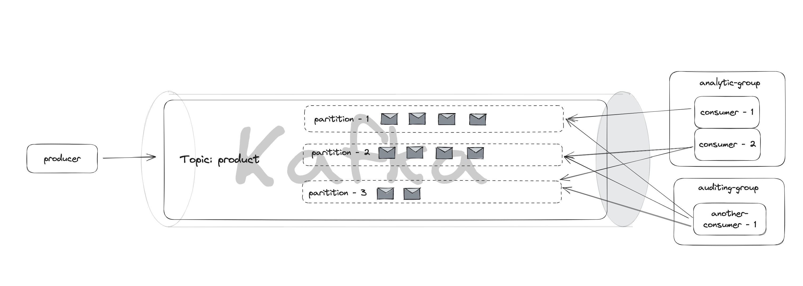

# Spring Boot Kafka Demo

This is a demo project of Spring Boot 3 with Kafka. Please check different branches for details:

+ message-type-string: the payload is only `String`
+ message-type-object: the payload is java object (based on `message-type-string`)
+ message-routing: enables specific partition routing settings (based on `message-type-object`)
+ DLQ: contains dead letter queue (based on `message-routing`)
+ main: contains all functions 
## Architecture


## Tech Stack

+ Spring Boot 3
+ Spring Kafka
+ Lombok
+ Kadeck
+ Postman

## Step

**Setup Kafka Infra**

1. change to infra dir 
    ```
   cd infra
   ```
   
2. start kafka in docker compose
   ```shell
   docker compose -f docker-compose.yml up
   ```
   
3. access kafka broker use cli `docker exec -it <container_name> <command_dir>`

   + enter Kafka container
   ```shell
   docker exec -it kafka /bin/sh
   ```
   + change to bin folder `cd /opt/kafka_<version>/bin`
   ```shell
   cd opt/kafka_2.13-2.8.1/bin
   ```
   + create kafka topic
   ```shell
   kafka-topics.sh --create --zookeeper zookeeper:2181 --replication-factor 1 --partitions 1 --topic lea-seydoux
   ```
   or with 3 partitions
   ```shell
   kafka-topics.sh --create --zookeeper zookeeper:2181 --replication-factor 1 --partitions 3 --topic many-pars
   ```

   + start kafka-producer console and send messages
   ```shell
   kafka-console-producer.sh --topic lea-seydoux --bootstrap-server localhost:9092
   ```
   + start kafka-consumer console and consume messages
   ```shell
   kafka-console-consumer.sh --topic  lea-seydoux --from-beginning --bootstrap-server localhost:9092
   ```

By following above steps, you can get your hands dirty with kafka producer, broker and consumer only using kafka.

In this demo, we will create standalone producer spring boot application and consumer spring boot application.

**Kafka UI Tool - Kadeck**

You can download kafka UI tool to visualize the kafka topics and messages
Link: https://www.kadeck.com/


## Other Useful Commands
Start Zookeeper Server
```shell
sh bin/zookeeper-server-start.sh config/zookeeper.properties
```

Start Kafka Server / Broker
```shell
sh bin/kafka-server-start.sh config/server.properties
```
> Note: If use docker-compose up command, kafka and zookeeper will automatically spin up

list out all topic names
```shell
sh bin/kafka-topics.sh --bootstrap-server localhost:9092 --list
```

Describe topics
```shell
sh bin/kafka-topics.sh --bootstrap-server localhost:9092 --describe --topic NewTopic
```

## Common Q&A

Q: failed to resolve class name. Class not found `[com.jtsp.producer.dto.ProductPayload]`
A: use following config on consumer side 
```yaml
spring:
  kafka:
    consumer:
      bootstrap-servers: localhost:9092
      group-id: group-1
      key-deserializer: org.apache.kafka.common.serialization.StringDeserializer
      value-deserializer: org.springframework.kafka.support.serializer.JsonDeserializer
      properties:
        spring.json.trusted.packages: "*"
        spring.json.use.type.headers: false
        spring.json.value.default.type: com.jtsp.consumer1.dto.ProductPayload
```
R: https://stackoverflow.com/questions/72798060/spring-for-apache-kafka-json-deserialization-exception-class-not-found
Official Doc: https://docs.spring.io/spring-kafka/reference/kafka/serdes.html#serdes-mapping-types

